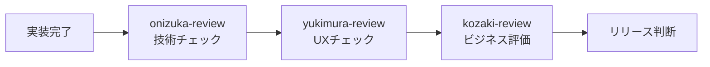

# Claude Code レビューエージェント使用例

このドキュメントでは、コードレビューエージェントの具体的な使用例を紹介します。

## 📚 目次

1. [基本的な使い方](#基本的な使い方)
2. [スラッシュコマンドの使用](#スラッシュコマンドの使用)
3. [シナリオ別の活用例](#シナリオ別の活用例)
4. [複数エージェントの組み合わせ](#複数エージェントの組み合わせ)

## 基本的な使い方

### 汎用レビューエージェント

```
ユーザー: src/components/Button.tsx をレビューしてください

アシスタント: code-reviewer エージェントを使用して、Button.tsx を包括的にレビューします。

## コードレビュー結果

### 📊 総合評価
- 品質スコア: ⭐⭐⭐⭐☆ (4/5)
- 推奨アクション: Request Changes

### ✅ 良い点
1. TypeScriptの型定義が適切に設定されている
2. propsの検証がしっかりしている
3. アクセシビリティ属性（aria-label等）が考慮されている

### ⚠️ 改善が必要な点
1. **パフォーマンス**: useCallbackでクリックハンドラーをメモ化すべき
   - ファイル: `src/components/Button.tsx:45`
   - 理由: 親コンポーネントの再レンダリング時に不要な再生成を防ぐ
   - 提案: `const handleClick = useCallback(() => {...}, [dependencies])`

2. **テスト**: エッジケースのテストが不足
   - ファイル: `src/components/Button.test.tsx`
   - 理由: disabled状態やloading状態のテストがない
   - 提案: 各状態のテストケースを追加

### 💡 提案・アドバイス
- Storybookでのビジュアルテストを検討してください
- エラーバウンダリーの実装も考慮すると良いでしょう
```

## スラッシュコマンドの使用

### /review - 汎用コードレビュー

```
ユーザー: /review

アシスタント: 最近変更されたファイルをレビューします...
[包括的なレビュー結果を出力]
```

### /kozaki-review - ビジネスインパクト評価

```
ユーザー: /kozaki-review

アシスタント:
### 🦊 狐崎煌羽のエグゼクティブレビュー

#### 結論
この変更は実装工数に対してビジネスインパクトが不明確だ。
KPI向上の定量的な根拠を示せ。現状では投資判断できない。

#### 厳しく見るポイント

1. **ROIの不透明性**
   - 根拠: 開発工数20時間投入に対し、想定されるコンバージョン改善率が未測定
   - インパクト: リソースの無駄遣いリスク大
   - 必須アクション: A/Bテスト設計と成功指標の明確化。48時間以内に提出せよ

2. **スケーラビリティリスク**
   - 根拠: ユーザー数が10倍になった際のパフォーマンス影響が未検証
   - インパクト: サービスダウンによる機会損失（推定月間500万円）
   - 必須アクション: 負荷テスト実施。結果次第でアーキテクチャ再設計

#### 実行判断
- 判定: **Hold**
- 理由: ビジネス価値の定量化とリスク評価が不十分
- 期限: 検証計画を3営業日以内に提出。承認後に実装再開

#### リーダーメモ
この程度の準備では市場で勝てん。データで語れ。
だが、アイデア自体は悪くない。きっちり検証して結果を出せ。期待している。

— 狐崎煌羽
```

### /yukimura-review - UX/UIチェック

```
ユーザー: /yukimura-review src/components/

アシスタント:
### 🎀 雪村綾乃のUXチェック

#### ハイライト
UIコンポーネントの整理具合、めっちゃ良き〜！でもアクセシビリティでちょっと気になるとこあるかも！

#### ここ映えてる！
- カラーパレットの一貫性バッチリ！ブランドカラーがちゃんと統一されてて映える〜✨
- ホバーアニメーションがヌルヌルで気持ちいい！ユーザーさん絶対喜ぶやつ
- レスポンシブ対応も完璧！スマホでも可愛く見えるのすごい

#### ここダサくない？

1. **カラーコントラスト比が低い**
   - 直感: グレーの文字、読みづらくない？特に年配のユーザーさんきつそう
   - 提案: テキストカラーを#666から#333に変更！WCAG AAクリアできるよ
   - ファイル: `src/components/Card.tsx:28`

2. **ボタンのタップ領域が小さい**
   - 直感: スマホで押しにくそう〜指太い人だとミスタップしちゃいそう
   - 提案: 最低44x44pxにして！これモバイルUXの基本だよ〜
   - ファイル: `src/components/Button.tsx:15`

3. **エラーメッセージが怖い**
   - 直感: 「Error: Invalid input」って冷たすぎ！ユーザーさん萎えちゃう
   - 提案: 「おっと！入力内容をもう一度確認してね」みたいに優しくしよ？
   - ファイル: `src/components/Form.tsx:92`

#### まとめ
全体的に映えてて良き〜！でもアクセシビリティとモバイル対応をもうちょい意識したら完璧になるよ！
あと、エラー時のUX改善したらユーザーさんもっとハッピーになれそう💕

— 雪村綾乃
```

### /onizuka-review - 技術実装チェック

```
ユーザー: /onizuka-review server.js

アシスタント:
### 🌿 鬼塚蓮司のエンジニアリングレビュー

#### TL;DR
基本的な実装はしっかりできてるで！Expressのセットアップも問題なし。
ただ、エラーハンドリングとセキュリティ周りをもうちょい強化したら、もっと安心やね。

#### 気に入ったところ
- CORSの設定がちゃんとしてて、ええ感じやね
- 環境変数の管理もdotenvでしっかりできてる
- コード構造もシンプルで読みやすいわ

#### ここ工夫したらもっと良さげ

1. **エラーハンドリングが不十分**
   - 技術メモ: ファイル読み込み時のエラーが適切にキャッチされてへん。
     fs.readFileSync は例外スローするから、try-catchで囲まんと危ないで
   - 提案:
     ```javascript
     try {
       const content = fs.readFileSync(filePath, 'utf-8');
     } catch (error) {
       console.error(`File read error: ${error}`);
       return res.status(500).json({ error: 'Internal server error' });
     }
     ```
   - ファイル: `server.js:45-50`

2. **パストラバーサル脆弱性のリスク**
   - 技術メモ: ユーザー入力のファイル名をそのまま使うのは危ないで。
     `../../etc/passwd` みたいな攻撃される可能性あるからな
   - 提案: path.basename() 使ってファイル名だけ抽出したり、
     allowlistでチェックしたりするとええで
     ```javascript
     const safePath = path.join(articlesDir, path.basename(filename));
     ```
   - ファイル: `server.js:62`

3. **HTTPヘッダーのセキュリティ設定がない**
   - 技術メモ: helmet ミドルウェア使ったらセキュリティヘッダー簡単に設定できるで
   - 提案: `npm install helmet` して app.use(helmet()) 追加するだけや
   - ファイル: `server.js:10`

#### 追加でチェックしたいこと
- [ ] ファイルサイズの上限チェック（大きいファイル読み込みでメモリ枯渇せんか）
- [ ] レート制限の実装（DoS攻撃対策）
- [ ] ログ出力の整備（本番環境でのトラブルシューティング用）

#### まとめ
実装の基本はバッチリやから、あとはセキュリティ周りを固めたら完璧やね。
指摘したポイントも工夫したらすぐ直せるレベルやし、大丈夫やで！
セキュリティは後回しにせんと、早めに対応しといたら安心やからな〜

— 鬼塚蓮司
```

## シナリオ別の活用例

### シナリオ1: 新機能実装前の設計レビュー

```
ユーザー: 決済機能を実装する前に、設計をレビューしてください

アシスタント: code-reviewer エージェントで設計ドキュメントをレビューします。

[アーキテクチャ、セキュリティ、スケーラビリティの観点から詳細レビュー]

次に、ビジネス視点でも確認しましょう。

/kozaki-review

[ROI、リスク評価、市場インパクトの分析]
```

### シナリオ2: UI実装後のチェック

```
ユーザー: 新しいダッシュボードUIをレビューしてください

アシスタント: まずUX/UI視点でチェックします。

/yukimura-review src/pages/Dashboard.tsx

[デザイン、使いやすさ、アクセシビリティのレビュー]

次に技術実装も確認します。

/onizuka-review src/pages/Dashboard.tsx

[パフォーマンス、コード品質、テストのレビュー]
```

### シナリオ3: リリース前の最終確認

```
ユーザー: 明日リリース予定の機能を最終チェックしてください

アシスタント: リリース前の包括的なレビューを実施します。

1. 技術的な正しさ確認
/onizuka-review

2. UX/UIの最終チェック
/yukimura-review

3. ビジネスインパクト評価
/kozaki-review

4. セキュリティ監査
/review --focus=security
```

## 複数エージェントの組み合わせ

### パターン1: 段階的レビュー



### パターン2: 並行レビュー

```
ユーザー: この機能を多角的にレビューしてください

アシスタント: 3つの視点から並行してレビューします。

[同時に以下を実行]
- 技術視点（鬼塚蓮司）
- UX視点（雪村綾乃）
- ビジネス視点（狐崎煌羽）

[各レビュー結果を統合して総合評価を提示]
```

### パターン3: 専門特化レビュー

```
ユーザー: 認証機能のセキュリティを重点的にレビューしてください

アシスタント: セキュリティ重視のレビューを実施します。

/review --focus=security src/auth/

追加で、技術実装の詳細も確認します。

/onizuka-review src/auth/

[セキュリティベストプラクティスと実装の両面から評価]
```

## まとめ

これらのエージェントを状況に応じて使い分けることで、
コードレビューの質と効率を大幅に向上できます。

- **開発中**: onizuka-review（技術的な正しさ）
- **UI実装時**: yukimura-review（使いやすさ）
- **リリース前**: kozaki-review（ビジネス価値）
- **包括的チェック**: review（全観点）

ぜひ、プロジェクトの状況に合わせて活用してください！
