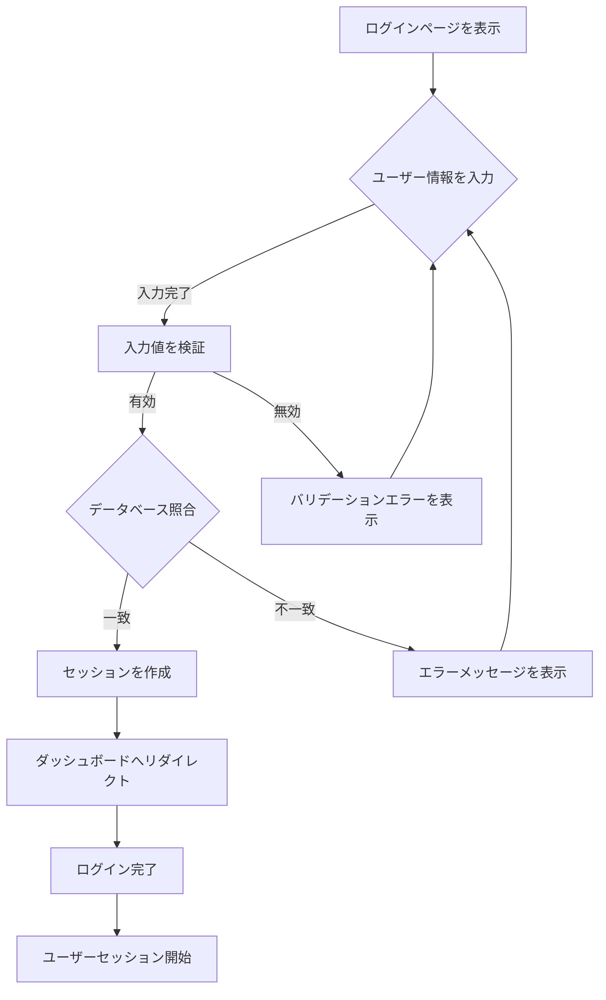
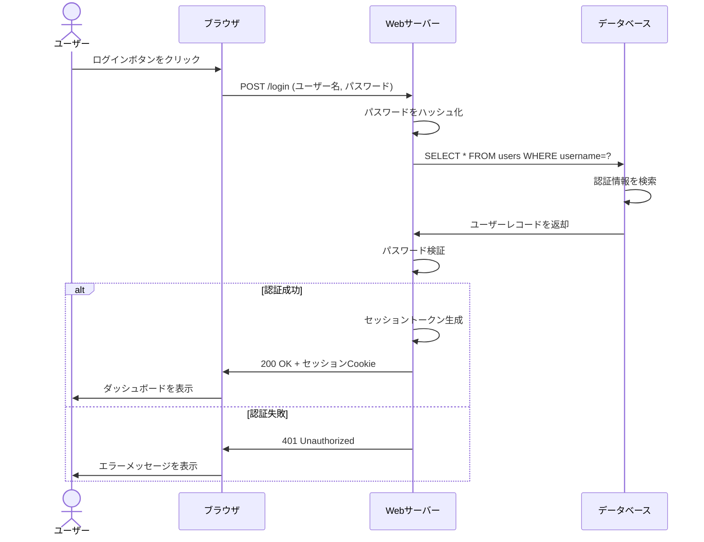
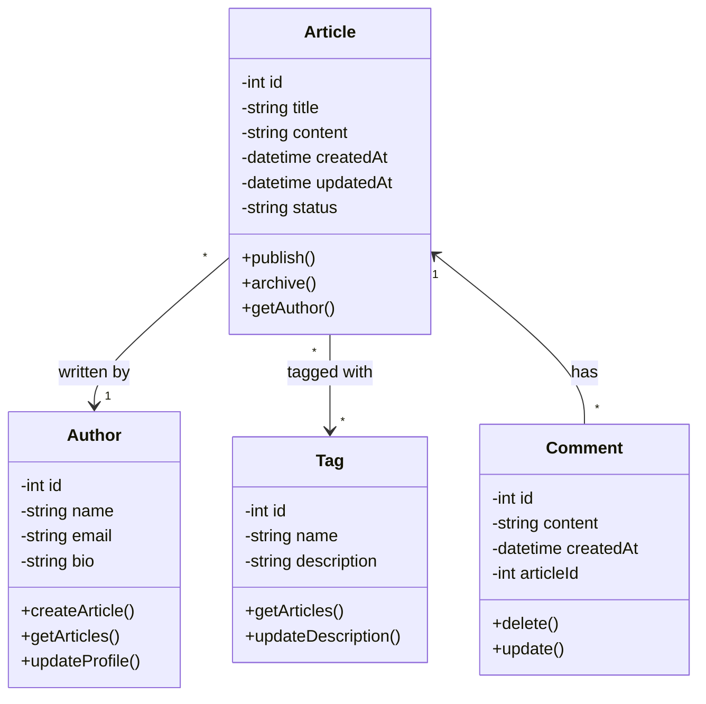
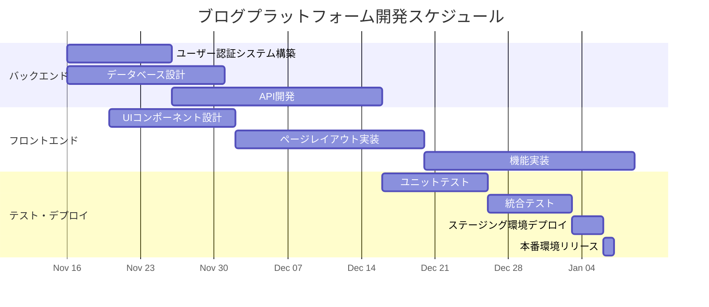
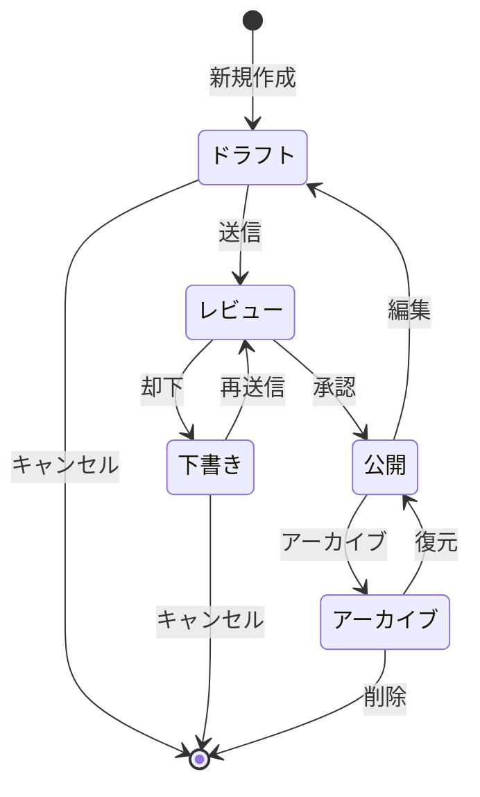
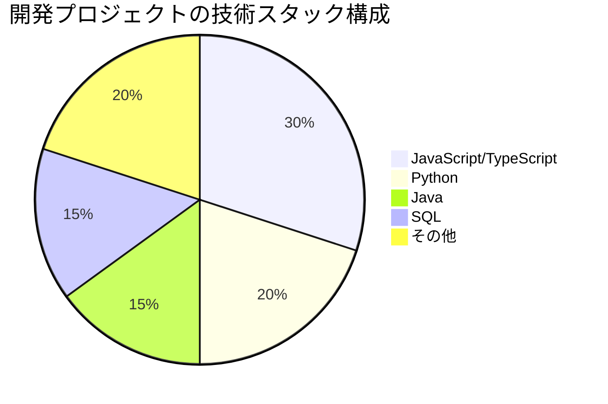

## はじめに

Mermaidは、シンプルなマークダウン構文を使ってダイアグラムやチャートを描画できる強力なJavaScriptベースのツールです。プログラマーやテクニカルライターが、複雑な図表を簡単に作成し、ドキュメントに直接埋め込むことができます。

このデモでは、Mermaidでサポートされている主要なダイアグラムタイプを紹介します。各タイプは実務的な例を通じて説明されています。

---

## 1. フローチャート (Flowchart)

フローチャートは、プロセスやアルゴリズムの流れを可視化するのに最適です。以下は、ユーザーログインプロセスの例です。



このフローチャートは以下のステップを示しています：
- ユーザー情報の入力
- 入力値のバリデーション
- データベースでの認証確認
- 成功時のセッション作成
- エラーハンドリング

---

## 2. シーケンス図 (Sequence Diagram)

シーケンス図は、複数のシステム間の相互作用と通信の流れを時系列で表示します。以下は、一般的なWebアプリケーションの通信例です。



このシーケンス図では以下が示されています：
- ユーザーアクションから始まる通信フロー
- 複数のシステムコンポーネント間の相互作用
- 成功と失敗の両方のパスを含む条件分岐

---

## 3. クラス図 (Class Diagram)

クラス図は、オブジェクト指向システムの構造を表現します。以下は、ブログ記事管理システムの例です。



このクラス図は以下を示しています：
- Articleクラスの主要なプロパティとメソッド
- Authorとの1対多の関係
- Tagとの多対多の関係
- Commentとの1対多の関係

---

## 4. ガントチャート (Gantt Chart)

ガントチャートは、プロジェクトのスケジュールと進捗を可視化するのに役立ちます。以下は、ブログプラットフォーム開発プロジェクトの例です。



このガントチャートは以下を表示しています：
- バックエンド、フロントエンド、テスト・デプロイのタイムライン
- タスク間の依存関係
- 全体的なプロジェクト期間

---

## 5. 状態遷移図 (State Diagram)

状態遷移図は、システムの状態の変化を表現します。以下は、ブログ記事のライフサイクルの例です。



このステート図は以下を示しています：
- 記事の状態：ドラフト、レビュー、公開、アーカイブ
- 状態間の遷移とトリガーアクション
- キャンセルと削除の終了パス

---

## 6. 円グラフ (Pie Chart)

円グラフは、全体に対する部分の割合を視覚的に表示します。以下は、技術スタックの構成比率を示しています。



このパイチャートは以下を示しています：
- JavaScriptとTypeScriptが全体の30%を占める
- バックエンド言語（Python、Java）の割合
- データベース技術（SQL）の比率
- 合計で100%となる構成

---

## 使い方 (How to Use)

### マークダウン構文

Mermaidダイアグラムをマークダウンファイルに埋め込むには、以下の構文を使用します：

```markdown
\`\`\`mermaid
[Mermaidコードをここに記述]
\`\`\`
```

### 基本要素

**フローチャート**の基本要素：
- `flowchart TD` - トップダウンの方向を指定
- `A[テキスト]` - 矩形ノード
- `A --> B` - 接続矢印

**シーケンス図**の基本要素：
- `participant 名前` - 参加者を定義
- `A->>B: メッセージ` - 実線の矢印メッセージ
- `alt ... else ... end` - 条件分岐

**クラス図**の基本要素：
- `class ClassName { プロパティ メソッド }` - クラス定義
- `A --> B` - 関係を定義

**ガントチャート**の基本要素：
- `task_id : label, date1, duration` - タスク定義
- `after task_id` - 依存関係を指定

**状態図**の基本要素：
- `[*]` - 開始/終了状態
- `state_a --> state_b` - 状態遷移

**円グラフ**の基本要素：
- `"ラベル" : 値` - データポイント

---

## まとめ

Mermaidは、テクニカルドキュメンテーションに強力な視覚的表現をもたらします。本デモで紹介した6つのダイアグラムタイプを組み合わせることで、複雑なシステムやプロセスを効果的に説明できます。

### Mermaidを使用する利点：

1. **シンプルな構文** - プログラマーにとって習得が簡単
2. **バージョン管理** - ダイアグラムもコードとして管理可能
3. **動的生成** - プログラムから動的にダイアグラムを生成可能
4. **広範なサポート** - 多くのドキュメンテーションツールとの統合

これらの機能を活用することで、より質の高い技術ドキュメントを作成できます。プロジェクトに応じて適切なダイアグラムタイプを選択し、Mermaidの能力を最大限に活用しましょう。

---

**関連リソース：**
- [Mermaid公式ドキュメント](https://mermaid.js.org/)
- [Mermaidの対応ダイアグラムタイプ](https://mermaid.js.org/intro/)
- [Mermaidのシンタックスハイライト設定](https://mermaid.js.org/syntax/configuration.html)
