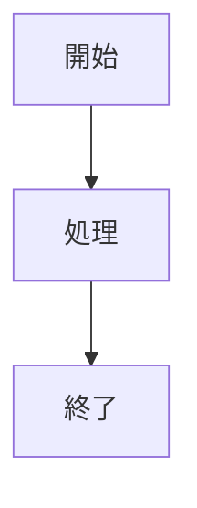

# トラブルシューティング

KumoCodeの使用中に発生する可能性のある一般的な問題と解決方法を説明します。

## ブラウザコンソールのエラーについて

GitHub Pagesにデプロイされたサイトを開くと、ブラウザのコンソールに複数のエラーが表示される場合がありますが、多くは**正常な動作**であり、サイトの機能には影響しません。

### 1. `ERR_BLOCKED_BY_CLIENT` エラー

```
Failed to load resource: net::ERR_BLOCKED_BY_CLIENT
```

**発生場所の例:**
- `www.youtube.com/generate_204`
- `www.youtube.com/youtubei/v1/log_event`
- `play.google.com/log`
- `res.ads.nicovideo.jp/assets/js/ads2.js`

**原因:**
ブラウザの拡張機能（広告ブロッカー、プライバシー保護ツールなど）がトラッキングや広告関連のリクエストをブロックしています。

**影響:**
なし。これは期待される動作であり、サイトの機能には影響しません。埋め込みコンテンツ（YouTube動画など）は正常に表示されます。

**対処法:**
特に対処の必要はありません。気になる場合は、ブラウザの拡張機能を無効化することでエラーを消すことができますが、プライバシー保護の観点からは推奨しません。

---

### 2. RSCプリフェッチの404エラー

```
GET https://sunwood-ai-labs.github.io/KumoCode.txt?_rsc=xxx 404 (Not Found)
```

**原因:**
Next.js 14のApp Routerは、`<Link>`コンポーネントを使用してページ間をナビゲートする際、React Server Components (RSC)のペイロードを事前読み込み（プリフェッチ）しようとします。しかし、`output: 'export'`による静的エクスポートモードでは、これらのRSCペイロードファイルは生成されません。

**影響:**
なし。プリフェッチが失敗した場合、Next.jsは自動的にクライアントサイドナビゲーションにフォールバックします。ページ遷移は正常に動作します。

**対処法:**
これは既知の動作であり、Next.jsの静的エクスポートを使用する際には避けられません。以下のいずれかの方法で対処できます:

1. **エラーを無視する（推奨）**: 機能に影響がないため、そのままにしておく
2. **プリフェッチを無効化する**: 各`<Link>`コンポーネントに`prefetch={false}`を追加
   ```tsx
   <Link href="/articles/example" prefetch={false}>
     記事を読む
   </Link>
   ```
3. **グローバルに無効化**: カスタムLinkコンポーネントを作成してプロジェクト全体で使用

**参考:**
- [Next.js Issue: RSC prefetch 404 errors with static export](https://github.com/vercel/next.js/discussions/54757)
- [Next.js Static Exports Documentation](https://nextjs.org/docs/app/building-your-application/deploying/static-exports)

---

### 3. favicon.svgの404エラー

```
GET https://sunwood-ai-labs.github.io/images/favicon.svg 404 (Not Found)
```

**原因:**
faviconのパスが正しく設定されていないか、`basePath`設定が適用されていない。

**解決方法:**
`app/layout.tsx`で、Next.jsのMetadata APIを使用してfaviconを設定してください:

```tsx
export const metadata: Metadata = {
  title: 'KumoCode',
  description: 'Modern Markdown Documentation Platform',
  icons: {
    icon: '/images/favicon.svg',
  },
}
```

`<head>`タグ内で直接`<link>`タグを使用すると、`basePath`が適用されない場合があります。

---

## ビルドエラー

### `npm run build`が失敗する

**考えられる原因:**
1. Node.jsのバージョンが古い（v18.0.0以上が必要）
2. 依存パッケージがインストールされていない
3. Markdown記事に構文エラーがある

**解決手順:**
```bash
# 1. Node.jsバージョンを確認
node --version  # v18.0.0以上であることを確認

# 2. 依存関係を再インストール
rm -rf node_modules package-lock.json
npm install

# 3. 再度ビルドを試行
npm run build
```

---

## GitHub Pagesデプロイの問題

### デプロイ後にページが表示されない

**確認事項:**
1. GitHubリポジトリの Settings > Pages でGitHub Pagesが有効になっているか
2. デプロイワークフロー（`.github/workflows/static-site.yml`）が正常に完了しているか
3. `next.config.js`の`basePath`がリポジトリ名と一致しているか

**解決方法:**
```javascript
// next.config.js
const nextConfig = {
  basePath: process.env.NODE_ENV === 'production' ? '/YourRepoName' : '',
  // ...
}
```

リポジトリ名が変更された場合は、`basePath`も更新する必要があります。

---

## Markdown記事の問題

### 数式が正しく表示されない

**原因:**
KaTeXの構文エラーまたは特殊文字のエスケープ不足。

**解決方法:**
- インライン数式: `$x^2$`
- ブロック数式:
  ```
  $$
  f(x) = x^2
  $$
  ```
- バックスラッシュは二重にエスケープ: `\\` → `\\\\`

### Mermaid図が表示されない

**原因:**
コードブロックの言語指定が`mermaid`になっていない。

**解決方法:**
````markdown

````

---

## パフォーマンスの問題

### ページの読み込みが遅い

**考えられる原因:**
1. 大きな画像ファイルが最適化されていない
2. Markdown記事が非常に長い
3. 複雑なMermaid図やKaTeX数式が多数含まれている

**解決方法:**
1. 画像を圧縮・最適化する（WebP形式の使用を推奨）
2. 長い記事を複数のページに分割
3. 不要な埋め込みコンテンツを削減

---

## その他の問題

### テーマが正しく適用されない

**解決方法:**
1. `.env`ファイルまたは環境変数で`NEXT_PUBLIC_DEFAULT_THEME`を確認
2. テーマファイル（`themes/`ディレクトリ）が存在するか確認
3. ブラウザのキャッシュをクリアして再読み込み

### 記事一覧に新しい記事が表示されない

**解決方法:**
1. `articles/`ディレクトリにMarkdownファイルがあるか確認
2. フロントマターに`title`と`date`フィールドがあるか確認
3. 再ビルドして確認: `npm run build && npm start`

---

## サポート

上記の方法で解決しない場合は、以下をご確認ください:

1. [GitHub Issues](https://github.com/Sunwood-ai-labs/KumoCode/issues)で既知の問題を検索
2. 新しいIssueを作成（エラーメッセージとブラウザのコンソールログを含める）
3. プロジェクトのドキュメントを参照:
   - [インストールガイド](./INSTALLATION.md)
   - [使い方](./USAGE.md)
   - [アーキテクチャ](./ARCHITECTURE.md)
